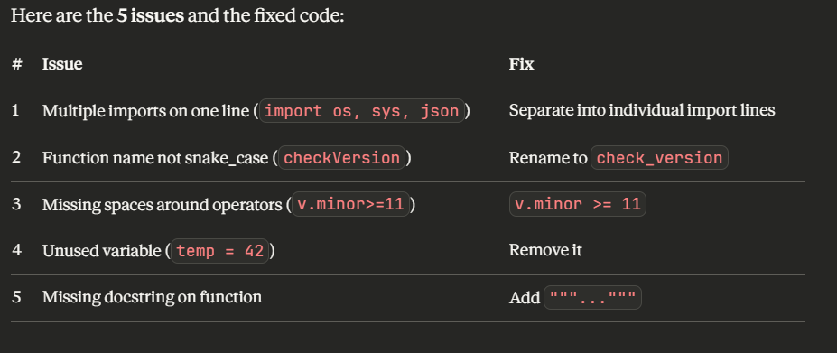

Q1: Explain Virtual Environments
A Python virtual environment is an isolated workspace that has its own Python interpreter and packages, separate from your system Python. Developers use them so that different projects can have different package versions without conflicting with each other. Without one, all packages install globally — if Project A needs numpy==1.24 and Project B needs numpy==2.0, one will break. Think of it like each project having its own separate toolbox — tools in one box don't affect any other.

Q2: Fix the 5 issues in this code

Q2: Coding —Fixed and improved code
"""Module to check Python version."""

import sys

def check_version():
    """Check if Python version is 3.11 or higher."""
    v = sys.version_info
    if v.major >= 3 and v.minor >= 11:
        return "Good"
    return "Bad"

result = check_version()
print("Version status:", result)

